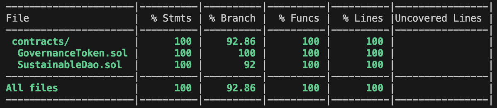

 

<h3 align="center">Sustainable Dao</h3>

  

    DAO project implementing decentralized proposal and voting system.
     
    <a href="https://github.com/rocconmarco/sustainable-dao"><strong>Repository GitHub »</strong></a>
     
  

## About The Project

The project was created as part of the <strong>"Smart Contract with Solidity Advanced"</strong> course of the Master's program in Blockchain Development at start2impact University. 

 

The goal was to build a <strong>DAO (Decentralized Autonomous Organization)</strong> for a company that offers training courses focused on the objectives of the 2030 Agenda.

 

The DAO allows the company to <strong>incentivize community engagement</strong> through proposals and voting, in which DAO members can participate.

 

## Specs for nerds

Starting from the basics, I decided to use the <strong>OpenZeppelin library</strong> to implement the governance token. Upon deploying the contract, <strong>half of the initial supply</strong> will be <strong>assigned to the owner</strong> (this allows flexibility in token management and for emergency situations), while the other half will be <strong>held in the GovernanceToken.sol contract.</strong>

 

Within GovernanceToken.sol, I implemented the fundSustainableDao function, which allows <strong>ONLY the owner</strong> to transfer tokens held by the contract to the SustainableDao.sol contract, which will manage the <strong>sale of tokens to the end users.</strong>

 

Before creating a proposal, users will need to purchase governance tokens and <strong>become members of the DAO.</strong> This can be done via the buyTokens function in the SustainableDao.sol contract. The collected funds will be held within the contract, and the corresponding amount of governance tokens (priced <strong>by default at 0.01 ETH</strong>) will be transferred to the user's balance, certifying their membership in the DAO.

 

Once a user becomes a member, they can <strong>create a proposal</strong> by providing a detailed description and publishing it on the blockchain. Proposals with an empty description cannot be submitted.

 

Once published, users will have <strong>2 days to vote</strong> for or against the proposal (the timelockDuration can be modified by the contract owner via a dedicated function). Voting can be done through <strong>direct democracy</strong> (the user votes autonomously, with their vote weighted according to the tokens they hold) or through <strong>liquid democracy</strong> (the user delegates someone else to vote on their behalf).

 

After the 2-day period ends, the contract owner can <strong>call the executeProposal function</strong>, and if the proposal has received a majority of favorable votes, it will be marked as executed.

 

All proposals are <strong>available for consultation</strong> in an array stored on-chain, which includes the proposer’s address, votes for and against, the total number of votes, the creation timestamp, and a boolean variable indicating whether the proposal has been executed.

 

### Testing

The two smart contracts have been <strong>thoroughly tested</strong> using the <strong>Hardhat framework.</strong> Comprehensive tests were designed for each contract, aiming to cover <strong>100% of the functions.</strong>

 

 

### Custom Errors

The latest conventions in <strong>error handling and gas optimization</strong> have been followed. Custom errors were created for every potential error in the protocol's usage, implementing them, where appropriate, in a dedicated modifier to improve code modularity.

 

### Naming Conventions

For <strong>greater clarity</strong> in code writing and to <strong>improve maintainability</strong>, the following conventions have been adopted:

<ul>
    <li>Storage variables: s_variableName</li>
    <li>Immutable variables: i_variableName</li>
    <li>Custom errors: ContractName_CustomErrorName</li>
</ul>

 

## Contacts

<strong>Marco Roccon - Digital Innovation & Development</strong> 
Portfolio website: https://rocconmarco.github.io/ 
Linkedin: https://www.linkedin.com/in/marcoroccon/ 
GitHub: https://github.com/rocconmarco

 

## Copyright

© 2024 Marco Roccon. All rights reserved.
